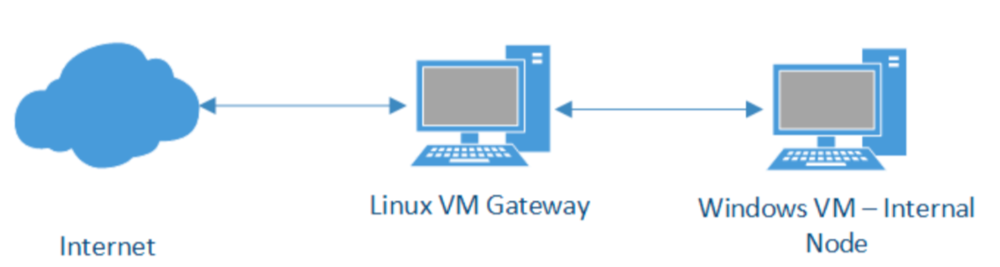

# Network-Security-Gateway-Firewall-Implementation

## 📌 Overview 
This project involved configuring a Linux VM as a secure gateway for a Windows VM, implementing advanced network security controls using iptables and bind9. The goal was to understand key networking concepts such as routing, NAT, SSH, DNS, HTTPS, and firewalls while setting up security rules to control traffic and enhance protection.

---
## 📖 Table of Contents
- [Key Topics Covered](#key-topics-covered)  
- [Architecture Overview](#architecture-overview)    
- [Setup and Configuration](#setup and configuration)  
  - [Network Configuration](#0️⃣-network-configuration)  
  - [DNS Configuration](#1️⃣-dns-configuration)  
  - [Routing](#2️⃣-routing)  
  - [iptables](#3️⃣-iptables) 
  - [Advanced Firewall Rules](#4️⃣-advanced-firewall-rules) 
  - [Testing and Validation](#5️⃣-testing-and-validation)
- [Learning Outcomes](#learning-outcomes)  
- [Contact](#contact)  
- [Acknowledgements](#acknowledgements)

---

### Key Topics Covered
- Routing and NAT using iptables
- DNS configuration using bind9
- Firewall rules for selective traffic control
- Advanced traffic filtering, logging, and rate limiting

---

### Architecture Overview
The project created a secure network architecture with the following components:
***Linux VM:***Configured as a gateway with two network interfaces:
- Adapter 1: NAT interface for internet access
- Adapter 2: Internal network interface for communication with the Windows VM

***Windows VM*** – Connected to the Linux VM through an internal network, using the Linux VM as a gateway
### 0️⃣ Environment Setup
- Configure a static IP address on the Linux VM using Netplan
- Enable IP forwarding to allow routing between internal and external networks
- Set up static IP and gateway as the IP of Linux VM on the Windows VM
- Make sure that the Linux VM can access the internet and the Windows VM can access the Linux VM and cannot access the internet directly.

### 1️⃣ DNS Configuration
- Install and configure bind9 as a caching DNS server on the Linux VM
- Verified caching performance using dig. The second command should be executed faster than the first one.

### 2️⃣ Routing
- Configure NAT using iptables
- Route all traffic from internal network to NAT network
- Allowe only RELATED and ESTABLISHED connections from NAT to internal network
- Performe IP masquerading for outgoing traffic

### 3️⃣ iptables
- Allowed traffic from internal network to NAT only for:
  SSH (10020/tcp)
  DNS (53/udp)
  HTTPS (443/tcp)
- Block all other ports
- Log all dropped packets with a custom prefix

### 4️⃣ Advanced Firewall Rules
- Configure logging of all dropped packets using rsyslog
- Set up rate limiting for HTTPS requests (10 requests per hour)
- Allowed ICMP Echo Requests but blocked other ICMP types

### 5️⃣ Testing and Validation
- Verify SSH, DNS, and HTTPS connectivity
- Ensure unauthorized port access was blocked
- Test rate limiting and ICMP controls using tcpdump and connection logs

---

### Learning Outcomes
- Configuring and troubleshooting iptables firewall rules
- Setting up and securing network communication using NAT and DNS
- Implementing granular traffic control with advanced firewall rules

---
## Contact
For any inquiries, feel free to reach out via:
📌 LinkedIn: www.linkedin.com/in/pranavs07

---

## Acknowledgements
This project was developed as part of a network security lab course, under the guidance of Prof. Guevara Noubir.

